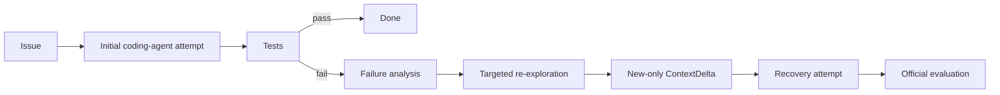

# ContextRepair

> Coding agents often fail because their initial understanding of a repository is incomplete. ContextRepair uses evidence from a failed repair to identify previously missed repository context and tests whether targeted re-exploration improves real software repair under a matched inference budget.

ContextRepair is a research implementation for one controlled question: does failure-conditioned repository re-exploration outperform an ordinary independent retry when model, tasks, attempts, and total inference budget are held fixed?



## Evidence status

A locked **40-task held-out benchmark** completed on 2026-09-02 after separate five-task pilot
and fresh-15 milestones. It contains 120/120 task-condition runs using `deepseek-v4-flash`,
temperature 0, provider-reported token usage, isolated SWE-bench task containers, and
task-specific official evaluator commands. The held-out subset excludes all earlier tasks and
has checksum `1efc1c75bcdf286a9fcd579d05fc8375abfbf34952cccfbfa0325a960516f626`.

| Method | Resolved | Recovery | Avg Tokens | Cost / Task | Wilson 95% CI |
|---|---:|---:|---:|---:|---:|
| Single Attempt | 22/40 (55.0%) | — | 91,975 | $0.0480 | 39.8–69.3% |
| Independent Retry | 21/40 (52.5%) | 3/22 (13.6%) | 133,464 | $0.0666 | 37.5–67.1% |
| ContextRepair | 22/40 (55.0%) | 1/19 (5.3%) | 135,692 | $0.0680 | 39.8–69.3% |

The 120 completed runs consumed 14,445,242 tokens and $7.3056; one interrupted Retry call
raised total charged held-out cost to $7.3154. Against Retry, ContextRepair had two paired wins,
one paired loss, and 37 ties: an observed **+2.5 percentage-point** difference with exact
McNemar p=1.0. ContextRepair also used 1.7% more tokens and 2.1% more completed-run cost per
task. The result does **not** support an improvement claim; it provides a complete, auditable
systems/evaluation artifact. See [HELDOUT40_RESULTS.md](HELDOUT40_RESULTS.md), [REPORT.md](REPORT.md),
and [`results/benchmark-heldout40-v1/statistics.json`](results/benchmark-heldout40-v1/statistics.json).

The earlier fresh-15 milestone remains documented in [FRESH15_RESULTS.md](FRESH15_RESULTS.md)
and is not pooled with the held-out rates.

Ground-truth localization metrics remain pending because this benchmark did not include a pinned
SWE-Explore annotation release.

## What is original

The project implements its own minimal provider-neutral coding-agent loop. No upstream agent
scaffold or source-repository checkout is vendored; public snapshots may include this project's
generated benchmark results and audit artifacts. The original research mechanism is split into
three auditable stages:

1. `FailureAnalyzer` turns the frozen trajectory, first patch, hypothesis, and test evidence into a typed failure analysis.
2. `FailureConditionedReExplorer` asks where to investigate next, while receiving the repository history so it can avoid already inspected context.
3. `ContextDeltaBuilder` executes read/search actions and admits only new files, symbols, code regions, tests, and dependencies within a hard context limit.

The LLM always decides how to repair. The recovery code contains no issue-specific patches, predefined patch candidates, or deterministic bug-fixing rules.

## Experimental conditions

- `SINGLE`: one ordinary attempt.
- `RETRY`: a second independent attempt in a fresh clone, with no structured failure analysis or ContextDelta.
- `CONTEXTREPAIR`: one failed attempt followed by failure analysis, new-only re-exploration, and one recovery attempt in the first workspace.

`RETRY` and `CONTEXTREPAIR` use identical default model settings and a shared per-task ceiling
of 200,000 total inference tokens, 100,000 tokens per attempt, and 80 calls across at most two
attempts. `SINGLE` has one 100,000-token, 40-call attempt. Analysis/re-exploration calls count
against ContextRepair's ceiling. Every task gets a fresh budget tracker. Reported usage is
provider-supplied when available; if a local compatible server omits it, character-based
estimates are explicitly marked with `usage_estimated: true`.

## Quick start

Use Python 3.11 or newer:

```bash
python -m venv .venv
source .venv/bin/activate
pip install -e ".[dev]"
```

On PowerShell, activate with `.venv\Scripts\Activate.ps1`. Copy `.env.example` if useful, but export credentials through the shell or a secret manager. Never paste keys into task descriptions or commit `.env`.

The shipped experiment configs use `deepseek-v4-flash` through DeepSeek's OpenAI-compatible endpoint and read `DEEPSEEK_API_KEY`. They use conservative peak token prices so reported cost is an upper-bound estimate. Keep model and price settings identical across conditions. Providers supported by the core package are `openai`, `openai-compatible`, `anthropic`, and local `ollama`.

A task descriptor points to an already prepared git checkout and its real evaluator command:

```json
{
  "instance_id": "owner__repo-1234",
  "issue": "Full issue text",
  "repo_path": "/absolute/path/to/prepared/repository",
  "base_commit": "full commit sha",
  "test_command": "pytest -q path/to/relevant_tests.py"
}
```

Run one task:

```bash
contextrepair run --task task.json --config configs/contextrepair.yaml
```

The source checkout is never edited. Each attempt runs in an isolated clone under its result directory.
Completed result directories are never overwritten; choose a new `--results` directory for another run.

## Locked benchmark workflow

Install the official benchmark harness in its own documented environment. ContextRepair does
not vendor the full SWE-bench dataset, images, annotations, or repository checkouts. A public
result snapshot may retain selected public task statements inside generated audit artifacts.

On Windows, run the pinned official harness through `Dockerfile.swebench`. This avoids
Windows CRLF translation when the harness copies evaluation scripts into Linux task
containers. Mount `/var/run/docker.sock` so the harness container can create the official
task containers; the harness source itself remains pinned in `requirements-benchmark.txt`.

If mounting the Docker socket into a harness container is not permitted, run
`scripts/apply_swebench_windows_compat.py` after installing the pinned Windows harness.
The script verifies the official source hash and changes only the newline argument used
when writing `patch.diff` and `eval.sh`; evaluation and grading logic remain unchanged.

1. Export the public SWE-bench Verified instance IDs, one per line.
2. Lock development and held-out sets deterministically:

```bash
contextrepair lock-subset --instances verified_ids.txt --output benchmark_subsets/dev.json --size 15 --seed 17
contextrepair lock-subset --instances heldout_ids.txt --output benchmark_subsets/final.json --size 50 --seed 29
```

Locked files contain a SHA-256 checksum and refuse to be overwritten. Commit them before running experiments. `benchmark_subsets/final.json` is intentionally unlocked and empty in the clean repository; filling it before evidence exists would be misleading.

3. Prepare identical repository environments and a JSONL descriptor file for every selected instance. The evaluator command must exercise the task's real tests. Run each condition:

```bash
contextrepair benchmark --subset benchmark_subsets/dev.json --tasks-file prepared_tasks.jsonl --condition single
contextrepair benchmark --subset benchmark_subsets/dev.json --tasks-file prepared_tasks.jsonl --condition retry
contextrepair benchmark --subset benchmark_subsets/dev.json --tasks-file prepared_tasks.jsonl --condition contextrepair
```

Benchmark runs resume safely by default: completed tasks are skipped, interrupted task
directories are archived before a clean retry, and `run_ledger.json` records completed plus
interrupted API cost after every task. Use one shared results directory and add
`--max-total-cost-usd 12.5` to enforce a conservative project-wide cap of roughly CNY 100
at 8 CNY/USD. The runner reserves the worst-case cost of the next task before starting it.

4. Produce SWE-bench prediction JSONL and run the official harness:

```bash
contextrepair evaluate --results results --condition contextrepair \
  --predictions predictions/contextrepair.jsonl --model-name MODEL --run-id final-contextrepair
```

Use `--prepare-only` to create predictions without invoking the harness. Official SWE-bench evaluator output—not the agent's focused test result—is the end-to-end score of record.

## Localization evaluation

`contextrepair.evaluation.sweexplore.localization_metrics` accepts standardized relevant-file and relevant-line annotations and calculates relevant-file recall, relevant-line coverage, and relevant context per 1K tokens. Initial read regions are recorded in trajectories; recovery regions are explicit in `context_delta.json`. Use public SWE-Explore annotations or another named standardized localization dataset and record the dataset version in the analysis.

The primary mechanism comparison is initial exploration versus the union of initial exploration and `ContextDelta`. Also stratify ContextRepair failures into recovered and non-recovered groups. Do not proceed to an expensive final SWE-bench run if re-exploration does not improve relevant-context acquisition on the development localization set.

## Artifacts and traceability

Each `results/<task>/<condition>/` directory contains:

```text
metadata.json
model_calls.json
initial_trajectory.json
initial.patch
initial_test.log
recovery_analysis.json       # ContextRepair failures only
context_delta.json           # ContextRepair failures only
recovery_trajectory.json     # second attempts only
recovery.patch               # second attempts only
recovery_test.log            # second attempts only
final.patch
final_result.json
workspaces/
```

Trajectory writes are atomic. Events include step, phase, role, action type, content, files, symbols, token usage, timestamp, and action metadata. Final results include patch hash, cost, timing, call counts, and resolution status.

## Ablations

The main comparison is `RETRY` versus `CONTEXTREPAIR`. Two flags in a copied ContextRepair config provide the required ablations:

- `recovery.use_execution_evidence: false`: failure analysis sees the issue and trajectory but not test output.
- `recovery.history_aware: false`: re-exploration is not told what was already inspected, and duplicate filtering is disabled.

Keep all other settings and the locked task IDs unchanged.

## Testing

Run deterministic tests without any model credential:

```bash
python -m unittest discover -s tests -v
```

The opt-in test at `tests/test_real_llm_integration.py` calls a real configured model, edits a real temporary git repository, and executes its tests. It is never replaced by a mock:

```bash
RUN_REAL_LLM_INTEGRATION=1 MODEL_PROVIDER=openai MODEL_NAME=YOUR_MODEL \
  python -m unittest tests.test_real_llm_integration -v
```

OpenAI-compatible providers can additionally set `MODEL_BASE_URL`,
`MODEL_API_KEY_ENV`, `MODEL_INPUT_COST_PER_MILLION`, and
`MODEL_OUTPUT_COST_PER_MILLION`.

Mocks/fakes may be added only to unit tests. A skipped integration test is not evidence that milestone M1 passed.

## Safety and limitations

The coding agent executes model-proposed shell commands. Run benchmark tasks inside disposable, network-restricted containers with bounded CPU, memory, disk, and time. Repository path checks prevent file tools from escaping the checkout, but the shell is intentionally capable because real coding agents must build and test software.

Current limitations:

- The held-out comparison contains 40 tasks. It is a substantial portfolio benchmark, but its
  intervals remain wide enough to prohibit a general model or publication-scale claim.
- ContextRepair exceeded Retry by one task and matched Single, but the paired comparison is not
  significant (exact McNemar p=1.0) and the recovery stage fixed only one initial failure.
- No standardized localization-annotation experiment has completed, so mechanism-level
  relevant-file or relevant-line recall remains unmeasured.
- Prepared task environments are an external prerequisite; official SWE-bench scoring remains delegated to its maintained harness.
- Token counts from providers that omit usage are estimates and clearly labeled.
- The lightweight symbol/dependency extractor is Python-aware; other languages still receive file and region deltas.
- Exactly one recovery cycle is supported by design.

See [REPORT.md](REPORT.md) for the completed analysis and remaining evidence gates.
