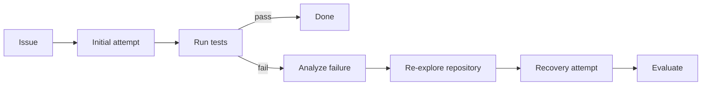

# ContextRepair

ContextRepair tests whether a coding agent can recover from a failed patch by revisiting
repository context selected from its failure trace. It compares this approach with a single
attempt and an independent retry under controlled model and token budgets.



## How it works

After an initial repair fails, ContextRepair:

1. Extracts a typed failure analysis from the trajectory, patch, and test output.
2. Plans targeted searches while avoiding repository context already inspected.
3. Builds a bounded context delta and gives it to a second repair attempt.

The package includes a provider-neutral coding-agent loop, isolated workspaces, Docker-backed
SWE-bench evaluation, token and cost limits, resumable benchmarks, and per-call tracing.

## Results

The final experiment ran all three conditions on 40 held-out SWE-bench Verified tasks using
`deepseek-v4-flash` at temperature 0. All 120 task-condition runs completed.

| Method | Resolved | Recovery rate | Avg. tokens/task |
|---|---:|---:|---:|
| Single attempt | 22/40 (55.0%) | -- | 91,975 |
| Independent retry | 21/40 (52.5%) | 3/22 (13.6%) | 133,464 |
| ContextRepair | 22/40 (55.0%) | 1/19 (5.3%) | 135,692 |

ContextRepair finished one task ahead of independent retry, but the paired difference was not
statistically significant (+2.5 percentage points; exact McNemar p=1.0). It also used 1.7% more
tokens. These results demonstrate the evaluation system, not a general performance improvement.

See [HELDOUT40_RESULTS.md](HELDOUT40_RESULTS.md) for the full held-out analysis,
[REPORT.md](REPORT.md) for experimental details, and
[FRESH15_RESULTS.md](FRESH15_RESULTS.md) for the earlier milestone.

## Quick start

Requires Python 3.11 or newer.

```bash
python -m venv .venv
source .venv/bin/activate
pip install -e ".[dev]"
```

On PowerShell, activate the environment with `.venv\Scripts\Activate.ps1`.

ContextRepair supports OpenAI, Anthropic, OpenAI-compatible endpoints, and local Ollama models.
The included experiment configs use an OpenAI-compatible endpoint and read credentials from
environment variables; see [.env.example](.env.example).

A task descriptor identifies a prepared repository checkout and its evaluator command:

```json
{
  "instance_id": "owner__repo-1234",
  "issue": "Full issue text",
  "repo_path": "/absolute/path/to/repository",
  "base_commit": "full commit sha",
  "test_command": "pytest -q path/to/relevant_tests.py"
}
```

Run one task:

```bash
contextrepair run --task task.json --config configs/contextrepair.yaml
```

Each attempt runs in an isolated clone. The source checkout is not modified.

## Benchmarking

Run the three experimental conditions on the same locked subset and prepared task file:

```bash
contextrepair benchmark --subset benchmark_subsets/dev.json \
  --tasks-file prepared_tasks.jsonl --condition single

contextrepair benchmark --subset benchmark_subsets/dev.json \
  --tasks-file prepared_tasks.jsonl --condition retry

contextrepair benchmark --subset benchmark_subsets/dev.json \
  --tasks-file prepared_tasks.jsonl --condition contextrepair
```

Generate predictions and invoke the official SWE-bench evaluator:

```bash
contextrepair evaluate --results results --condition contextrepair \
  --predictions predictions/contextrepair.jsonl --model-name MODEL --run-id RUN_ID
```

Completed runs are skipped when a benchmark resumes. Each result records the configuration,
trajectory, patches, test output, token usage, cost, timing, and final resolution status.

## Testing

Run the deterministic test suite without model credentials:

```bash
python -m unittest discover -s tests -v
```

The real-model integration test is opt-in:

```bash
RUN_REAL_LLM_INTEGRATION=1 MODEL_PROVIDER=openai MODEL_NAME=YOUR_MODEL \
  python -m unittest tests.test_real_llm_integration -v
```

## Limitations

- The held-out sample contains 40 tasks, so confidence intervals remain wide.
- No standardized localization-annotation evaluation has been completed.
- The symbol and dependency extractor has richer support for Python than other languages.
- ContextRepair currently supports one recovery cycle.
- Model-proposed shell commands should run only in disposable, restricted environments.
